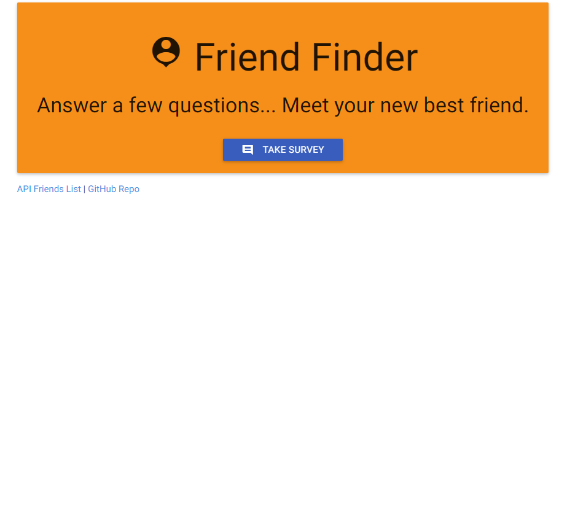

# FriendFinder

Created during module-13 of the University of Denver's Full-Stack Web Dev Bootcamp. The goal was to create a Friend Finder app (essentially a dating app, but for friends) using Node and Express servers. The user enters the page that leads to a survey. When the user submits the survey, they are matched with a "friend" that has the closest match to their personality.

## Getting Started
[Heroku Link](https://github.com/JeffreyPhelps)

## Screen Shots


Index Page


Survey

## Technologies used
- Node.js
- body-parager NPM Package - https://www.npmjs.com/package/inquirer
- express NPM Package - https://www.npmjs.com/package/express
- path NPM Package - https://www.npmjs.com/package/path

### Prerequisites

```
- Node.js - Download the latest version of Node https://nodejs.org/en/
- Materialize - Add CDN link to HTML http://materializecss.com/getting-started.html
```

## Built With

* Sublime Text - Text Editor
* Materialize - Wireframe

## Authors

* **Jeffrey Phelps** - *HTML/JS/Node.js* - [Jeffrey Phelps](https://github.com/JeffreyPhelps)